# Exploring Transformer Attention Mechanisms

> A step-by-step walkthrough of **Single-Head** and **Multi-Head Self-Attention** — from the core math to scaled vs. unscaled comparisons — implemented from scratch in NumPy.

---

## Table of Contents

1. [What Is Self-Attention?](#1-what-is-self-attention)
2. [Key Building Block: Softmax](#2-key-building-block-softmax)
3. [Scaled Dot-Product Attention](#3-scaled-dot-product-attention)
4. [Sample Input Setup](#4-sample-input-setup)
5. [Multi-Head Attention](#5-multi-head-attention)
6. [Visualization with Heatmaps](#6-visualization-with-heatmaps)
7. [Unscaled Attention Variants](#7-unscaled-attention-variants)
8. [Scaled vs. Unscaled: Direct Comparison](#8-scaled-vs-unscaled-direct-comparison)
9. [Softmax Distribution Analysis](#9-softmax-distribution-analysis)
10. [Conclusion](#10-conclusion)

---

## 1. What Is Self-Attention?

Self-attention lets each token in a sequence **look at every other token** and decide how much to "attend" to it when building its own representation.

Every input token is projected into three vectors:

| Vector | Role | Analogy |
|--------|------|---------|
| **Q** (Query) | "What am I looking for?" | A search query |
| **K** (Key)   | "What do I advertise?"  | A document tag |
| **V** (Value) | "What do I actually contain?" | The document content |

### High-Level Flow

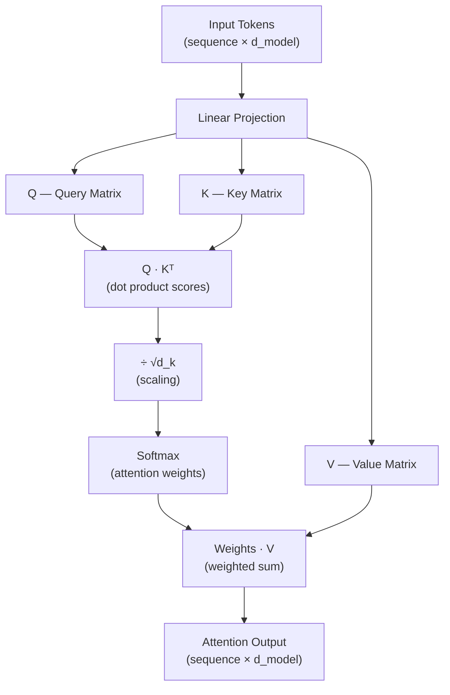

---

## 2. Key Building Block: Softmax

Before attention scores can be used as weights they must sum to 1. The **numerically-stable softmax** subtracts the row maximum before exponentiating, preventing overflow.

```python
def softmax(x):
    exp_x = np.exp(x - np.max(x, axis=-1, keepdims=True))
    return exp_x / exp_x.sum(axis=-1, keepdims=True)
```

### Why Numerical Stability Matters

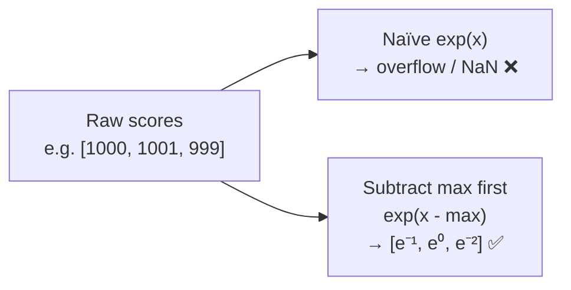

After softmax every row of the attention-weight matrix is a **probability distribution** (all values ≥ 0, each row sums to 1).

---

## 3. Scaled Dot-Product Attention

This is the core computation of a single attention head.

```python
def scaled_dot_product_attention(Q, K, V):
    d_k = Q.shape[-1]               # key/query dimension
    scores  = np.matmul(Q, K.T) / np.sqrt(d_k)
    weights = softmax(scores)
    output  = np.matmul(weights, V)
    return output, weights
```

### Step-by-Step Computation

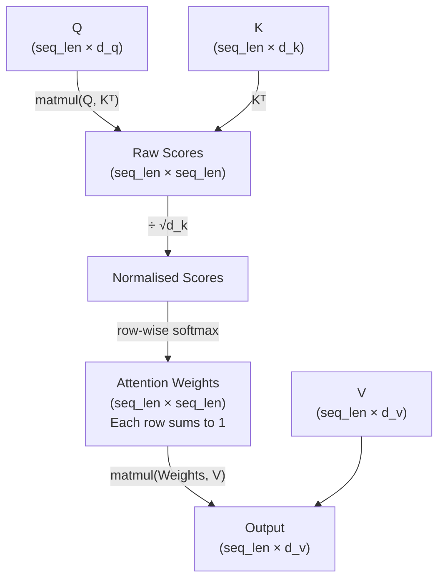

### Why Divide by √d_k?

As `d_k` grows, dot products grow in magnitude because they accumulate more terms. Large scores push softmax into its **saturation region**, producing near-zero gradients.

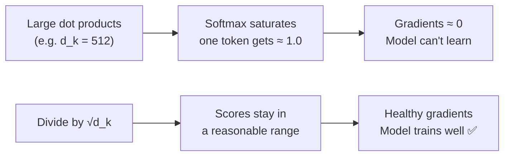

---

## 4. Sample Input Setup

```python
# 3 tokens, embedding dimension = 4
Q = np.random.rand(3, 4)
K = np.random.rand(3, 4)
V = np.random.rand(3, 4)
```

### Tensor Shapes Visualised

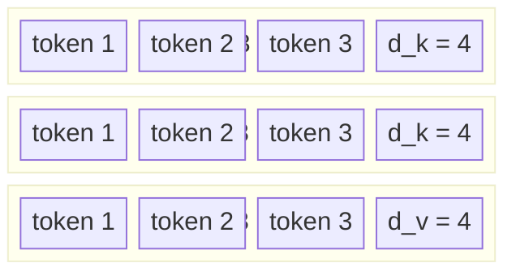

After attention the output shape is also **(3 × 4)** — same as the input. Each output token is now a **context-aware blend** of all value vectors.

### Reading the Attention-Weight Matrix

```
Attention Weights (3 × 3):
  [[0.30, 0.40, 0.30],   ← how much token 0 attends to tokens 0, 1, 2
   [0.34, 0.39, 0.28],   ← how much token 1 attends to tokens 0, 1, 2
   [0.33, 0.35, 0.32]]   ← how much token 2 attends to tokens 0, 1, 2
```

Entry `[i][j]` = how strongly **token i** attends to **token j**.

---

## 5. Multi-Head Attention

Instead of a single attention computation, multi-head attention runs **h parallel heads**, each on a different slice of the embedding. Their outputs are concatenated.

```python
def multi_head_attention(Q, K, V, num_heads):
    d_model = Q.shape[1]
    d_k     = d_model // num_heads          # per-head dimension

    heads_output = []
    for i in range(num_heads):
        # slice out the i-th head's chunk
        Q_h = Q[:, i*d_k : (i+1)*d_k]
        K_h = K[:, i*d_k : (i+1)*d_k]
        V_h = V[:, i*d_k : (i+1)*d_k]

        out, _ = scaled_dot_product_attention(Q_h, K_h, V_h)
        heads_output.append(out)

    return np.concatenate(heads_output, axis=-1)   # (seq_len × d_model)
```

### Multi-Head Attention Architecture

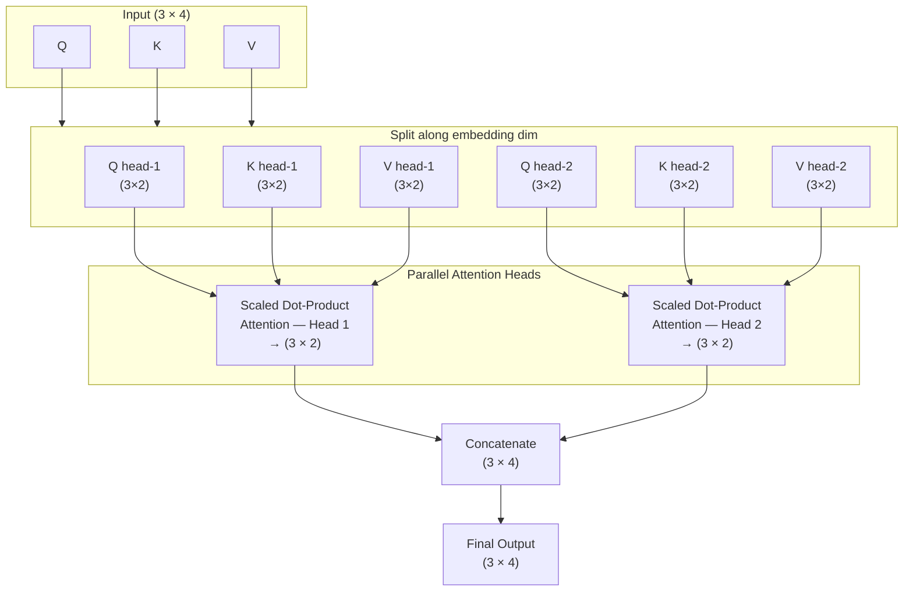

### Per-Head Dimension vs Number of Heads

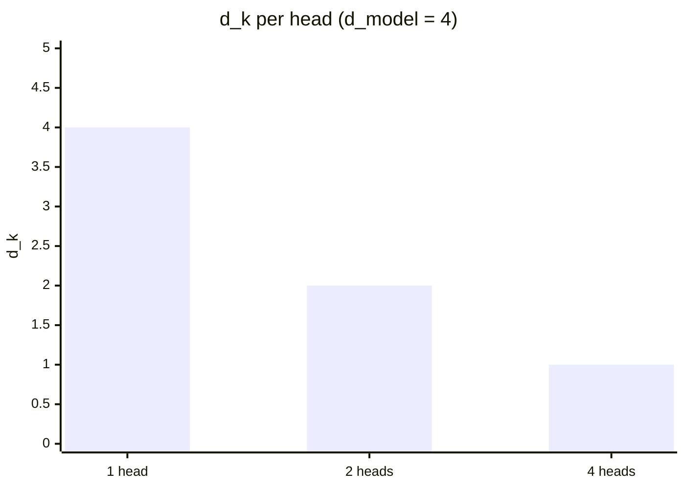

> **Key insight**: more heads → smaller per-head dimension, but richer multi-perspective representation overall.

---

## 6. Visualization with Heatmaps

The notebook plots heatmaps for each head configuration using `seaborn.heatmap`.

```python
import matplotlib.pyplot as plt
import seaborn as sns

plt.figure(figsize=(8, 6))
sns.heatmap(output_2head, annot=True, cmap='viridis', fmt=".2f")
plt.title('Heatmap of 2-Head Attention Output')
plt.xlabel('Output Dimension')
plt.ylabel('Token')
plt.show()
```

### What Each Axis Represents

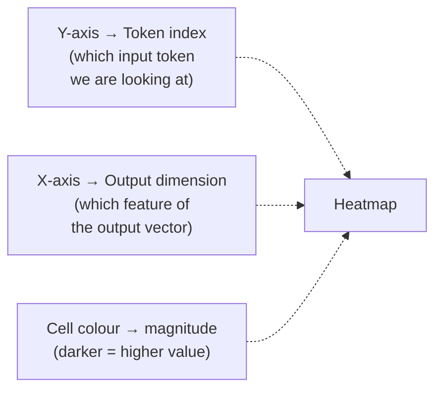

Comparing the three heatmaps side-by-side reveals how splitting across more heads produces **different feature patterns** per dimension.

---

## 7. Unscaled Attention Variants

To study the effect of the `1/√d_k` factor, identical functions are implemented **without** the scaling step:

```python
def scaled_dot_product_attention_withoutscaling(Q, K, V):
    d_k    = Q.shape[-1]
    scores = np.matmul(Q, K.T)          # ← no division by √d_k
    weights = softmax(scores)
    output  = np.matmul(weights, V)
    return output, weights
```

```python
def multi_head_attention_withoutscaling(Q, K, V, num_heads):
    # identical to multi_head_attention but calls the unscaled attention
    ...
```

### Scaled vs. Unscaled — Side-by-Side

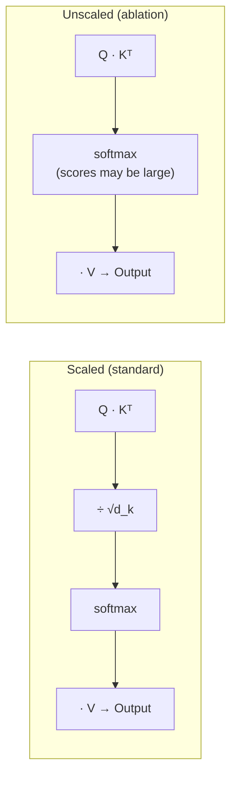

---

## 8. Scaled vs. Unscaled: Direct Comparison

The notebook computes the **absolute difference** between scaled and unscaled outputs for each head configuration and plots it as a red heatmap:

```python
diff_1head = np.abs(output_1head - withoutscaling_output_1head)
diff_2head = np.abs(output_2head - withoutscaling_output_2head)
diff_4head = np.abs(output_4head - withoutscaling_output_4head)
```

### Why the Differences Are Small Here

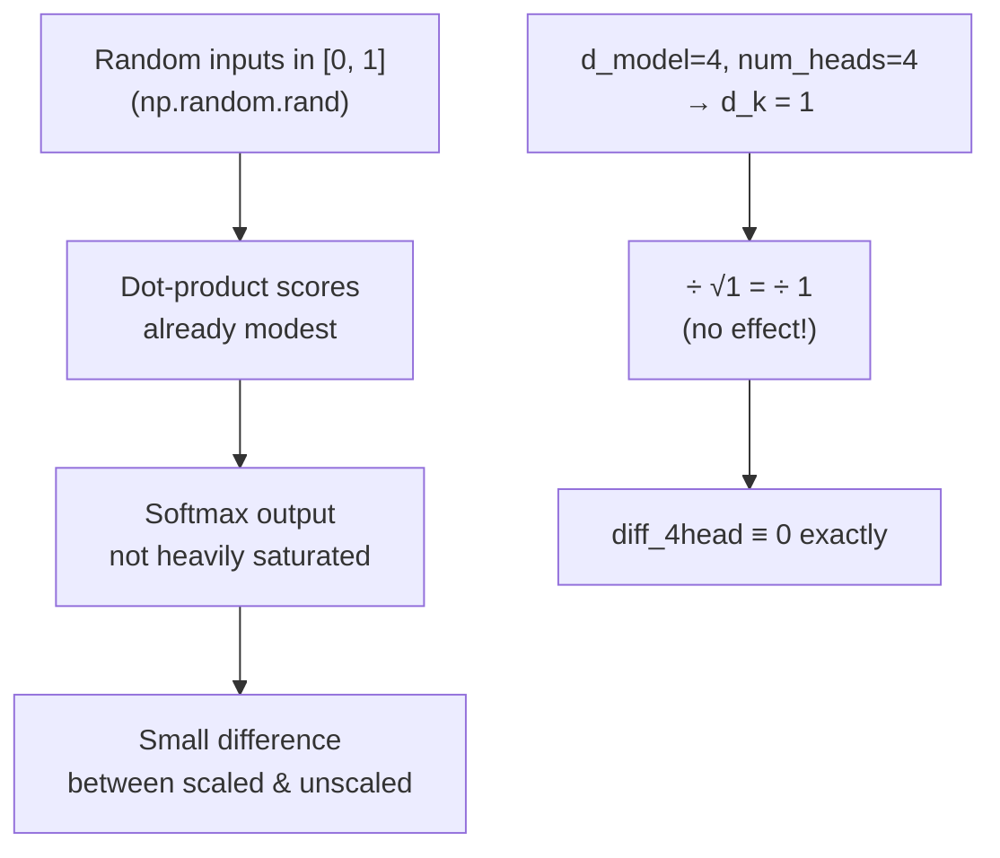

### Why Scaling Still Matters in Practice

| Scenario | Without Scaling | With Scaling |
|---|---|---|
| Small `d_k`, small inputs | Differences are tiny | Differences are tiny |
| Large `d_k` (e.g. 512) | Scores explode → softmax saturates → **vanishing gradients** | Scores stay well-behaved |
| Deep networks (many layers) | Gradient issues compound | Stable training |
| Long sequences | Attention becomes near-one-hot | Attention stays distributed |

---

## 9. Softmax Distribution Analysis

The notebook extracts the raw attention weight matrices and plots histograms to compare the **shape** of the distributions:

```python
_, scaled_weights   = scaled_dot_product_attention(Q, K, V)
_, unscaled_weights = scaled_dot_product_attention_withoutscaling(Q, K, V)

scaled_weights_flat   = scaled_weights.flatten()
unscaled_weights_flat = unscaled_weights.flatten()
```

### Distribution Behaviour

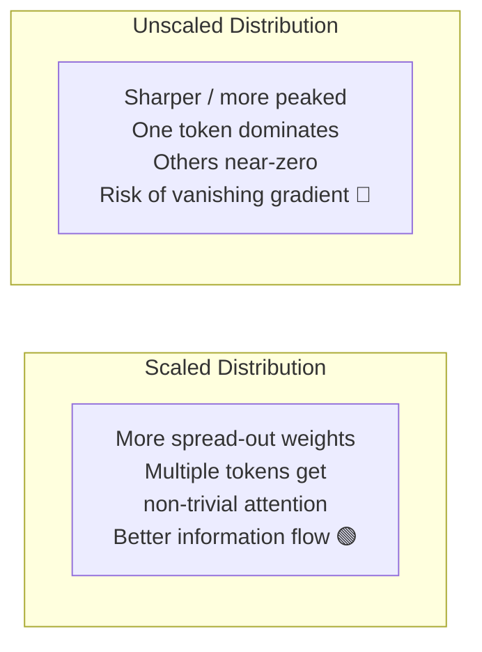

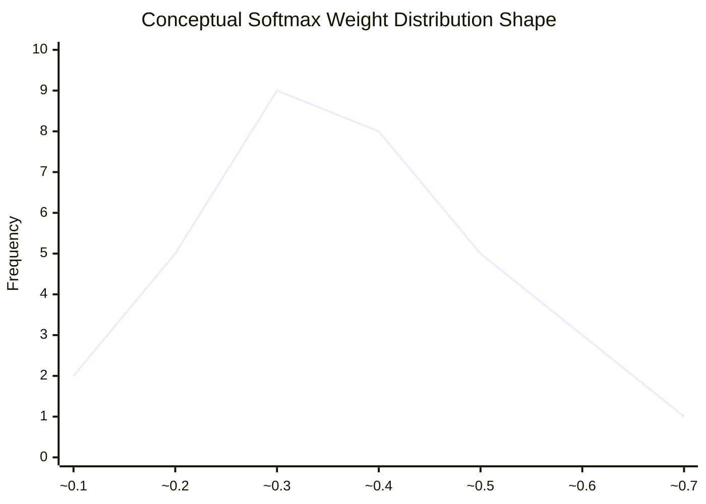

*(The scaled distribution looks similar to the bell-shaped curve above; the unscaled distribution is skewed toward 0 with a sharp spike near the dominant token.)*

### Implications

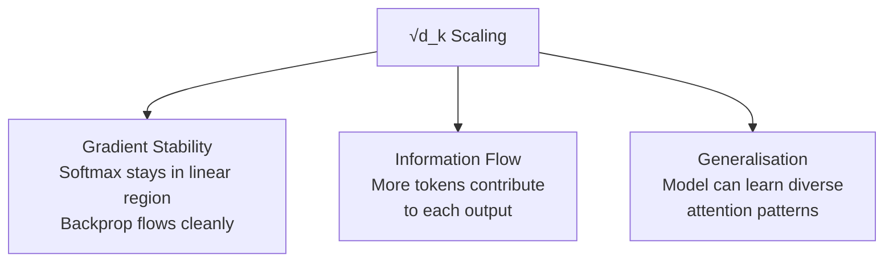

---

## 10. Conclusion

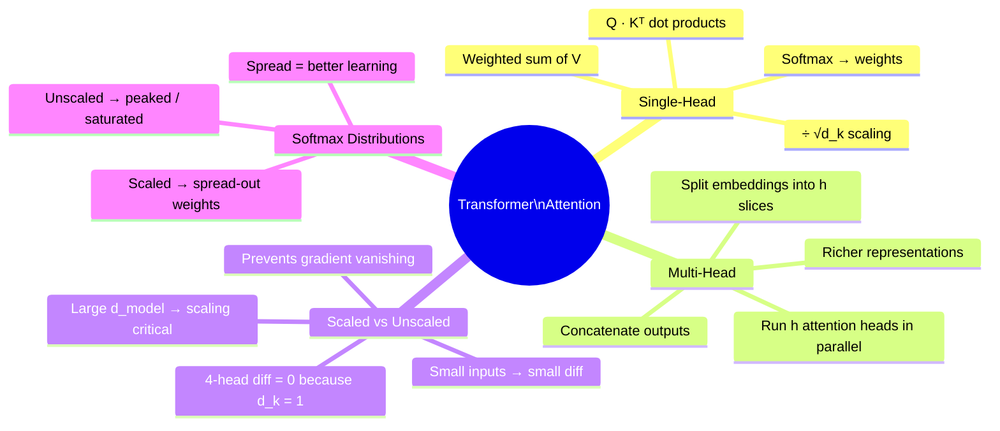

### Summary Table

| Feature | Single-Head | Multi-Head |
|---|---|---|
| Number of attention computations | 1 | h |
| Per-head dimension `d_k` | `d_model` | `d_model / h` |
| Output shape | `seq_len × d_model` | `seq_len × d_model` |
| Representation diversity | Single perspective | h different perspectives |
| Typical use | Baseline / study | Production transformers |

> **Key Takeaway:** The `1/√d_k` scaling factor is a small but critical detail. In this small NumPy demo (3 tokens, `d_model=4`) the differences are subtle, but in real models with `d_model ∈ {512, 768, 1024}` and millions of training steps, scaling is what keeps attention weights from saturating and gradients from vanishing.

---

*Notebook: `Self_Attention.ipynb` | Implementation: NumPy + Matplotlib + Seaborn*
